# Laporan Design Pattern

## Muhamad Saladin Eka Septian

--- 

## **Strategy Pattern**

Strategy Pattern adalah sebuah pola yang digunakan untuk mendefinisikan sebuah keluarga algoritma, mengenkapsulasi masing-masing algoritma, dan membuatnya dapat dipertukarkan. Pola ini memungkinkan algoritma untuk bervariasi secara independen dari klien yang menggunakannya.

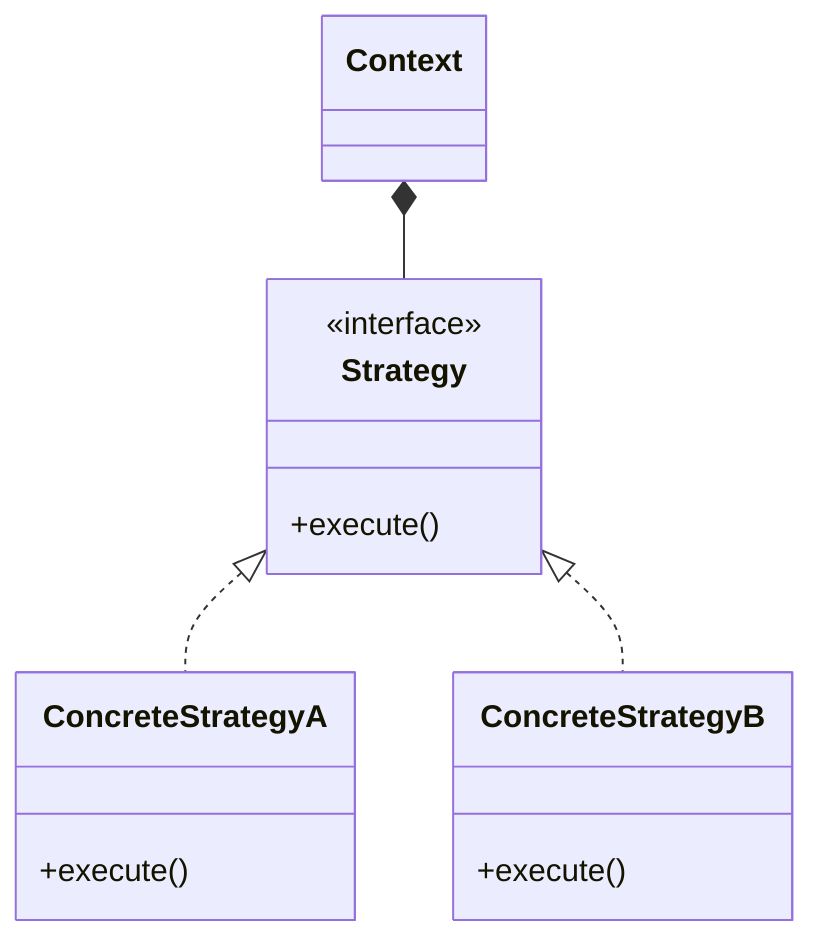

### **Struktur Kelas Strategy Pattern**

Strategy Pattern digunakan untuk menentukan strategi serangan yang bisa diganti-ganti pada runtime. Dengan pola ini, karakter dalam game dapat memiliki berbagai gaya bertarung yang dapat diubah tanpa perlu mengubah struktur utama dari objek karakter itu sendiri.

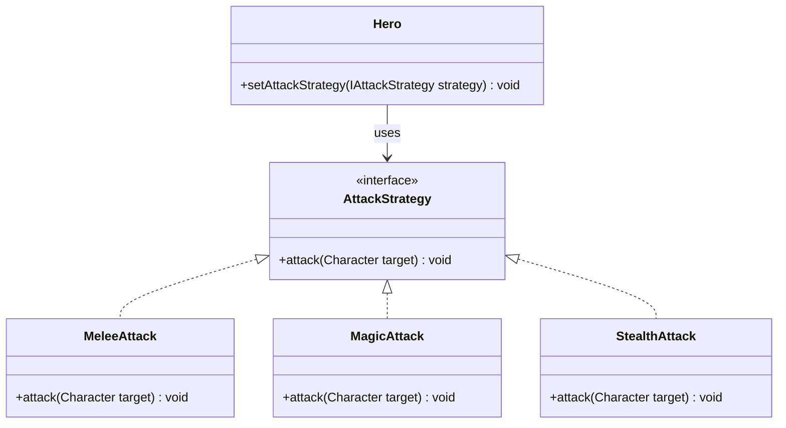

Dengan struktur ini, strategi serangan dapat diubah tanpa perlu memodifikasi kelas `Hero`, cukup dengan mengganti objek
`AttackStrategy` yang digunakan.

---

## **Builder Pattern**

Builder Pattern adalah salah satu creational design pattern yang memisahkan proses konstruksi suatu objek kompleks dari representasinya, sehingga proses konstruksi yang sama dapat menghasilkan berbagai representasi yang berbeda.

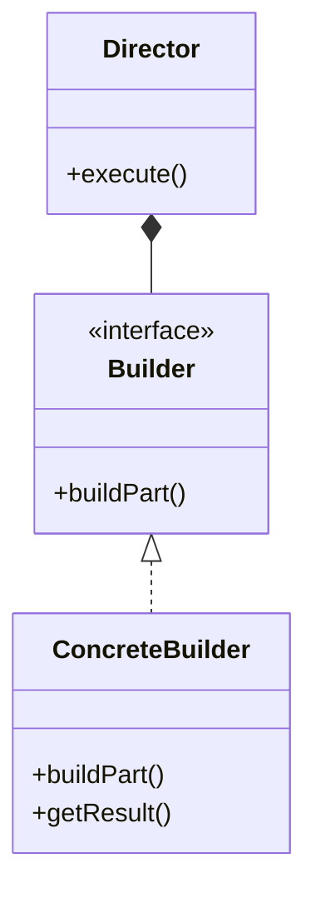

### **Struktur Kelas Builder Pattern**

Builder Pattern digunakan untuk membuat karakter dalam game dengan konfigurasi yang fleksibel. Alih-alih menggunakan
konstruktor dengan banyak parameter, pola ini memungkinkan pembuatan objek secara bertahap dengan hanya menyertakan
atribut yang dibutuhkan. Dengan demikian, proses inisialisasi karakter menjadi lebih terstruktur dan mudah dibaca.

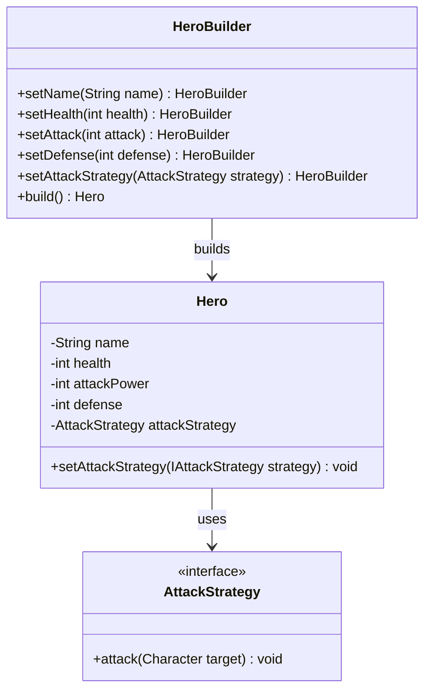

Dengan menggunakan `HeroBuilder`, objek `Hero` dapat dibuat secara bertahap tanpa harus menggunakan konstruktor dengan
parameter panjang.

---

## **Iterator Pattern**

Iterator Pattern adalah salah satu behavioral design pattern yang menyediakan cara untuk mengakses elemen dari suatu objek agregat secara berurutan tanpa mengekspos representasi dasarnya.

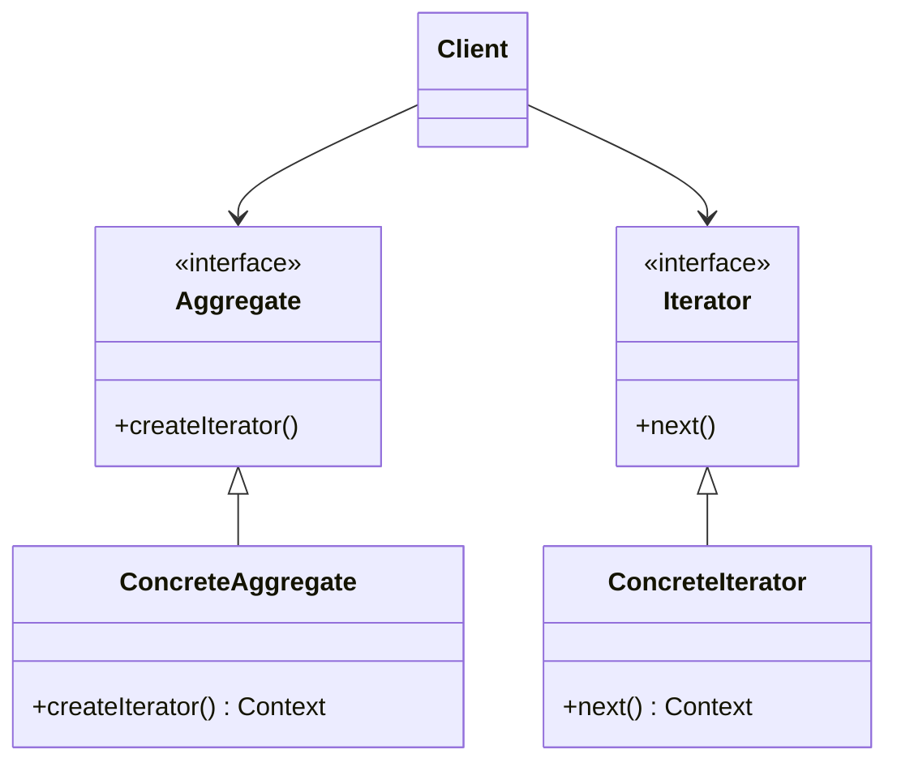

### **Struktur Kelas Iterator Pattern**

Iterator Pattern digunakan untuk mengiterasi ruangan dalam dungeon tanpa mengekspos implementasi koleksi secara
langsung. Dengan menggunakan iterator, pemain dapat menjelajahi setiap ruangan dalam dungeon satu per satu tanpa perlu
mengetahui bagaimana ruangan disimpan di dalam game. Pola ini membuat eksplorasi lebih modular dan meningkatkan
enkapsulasi dalam sistem.

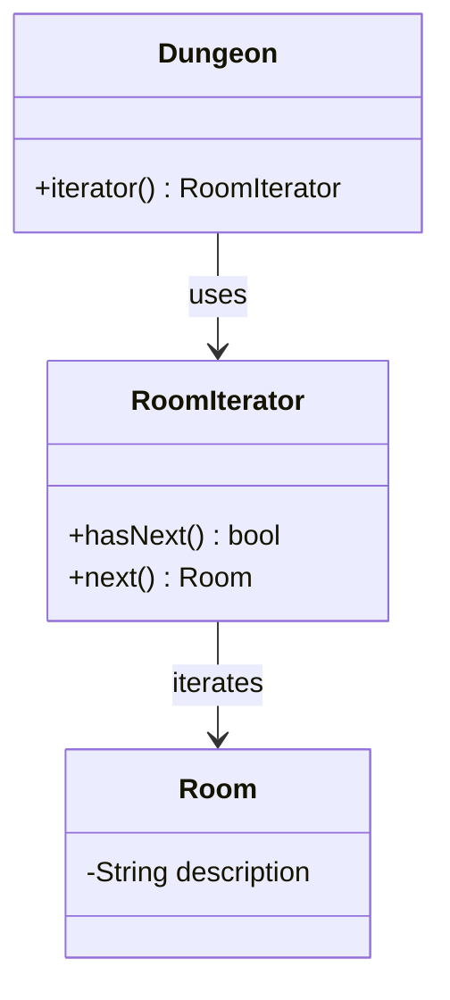

Dengan pola ini, eksplorasi dungeon menjadi lebih terstruktur karena `RoomIterator` bertanggung jawab atas iterasi
ruangan, sementara `Dungeon` hanya menyediakan akses ke iterator tanpa mengekspos struktur data internalnya.

---

## **CLI App**

Program ini merupakan game RPG Dungeon Crawler di mana pemain dapat memilih tipe karakter, menjelajahi dungeon yang
dibuat secara prosedural,
berinteraksi dengan objek di ruangan, seperti musuh, perangkap, atau potion, menggunakan strategi serangan yang berbeda
tergantung pada tipe karakter.

### **Use Case Diagram**

1. **Aktor**:
    - **Player**: Pemain yang mengontrol karakter dalam game.
2. **Use-Case Utama**:
    - **Create Character**: Pemain membuat karakter.
    - **Explore Dungeon**: Pemain menjelajahi dungeon.
3. **Use-Case yang Termasuk dalam Explore Dungeon**:
    - **Battle Enemy**: Pemain bertarung dengan musuh.
    - **Find Exit**: Pemain menemukan jalan keluar.
    - **Collect Potion**: Pemain mengumpulkan potion.
    - **Trigger Trap**: Pemain memicu perangkap.
4. **Use-Case yang Memperluas Battle Enemy**:
    - **Use Potion**: Pemain menggunakan potion selama pertarungan.
    - **Attack Enemy**: Pemain menyerang musuh selama pertarungan.

### **Class Diagram**

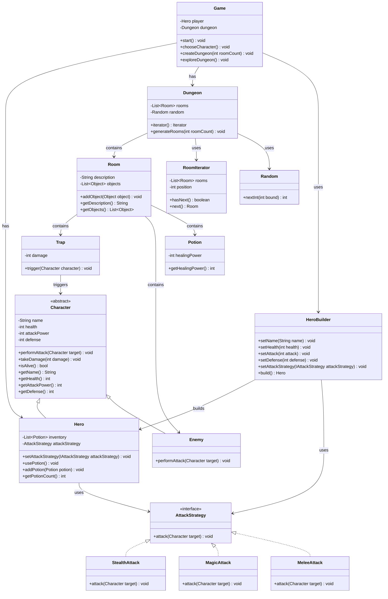

| **Kelas**                                             | **Atribut**                                                                   | **Metode**                                                                                                                                                                                                                  | **Deskripsi**                                                          |
|-------------------------------------------------------|-------------------------------------------------------------------------------|-----------------------------------------------------------------------------------------------------------------------------------------------------------------------------------------------------------------------------|------------------------------------------------------------------------|
| `Character`                                           | `-String name`   `-int health`   `-int attackPower`   `-int defense` | `+performAttack(Character target) void`   `+takeDamage(int damage) void`   `+isAlive() bool`   `+getName() String`   `+getHealth() int`   `+getAttackPower() int`   `+getDefense() int`                   | Kelas abstrak yang merepresentasikan karakter dalam game (hero/musuh). |
| `Hero`                                                | `-List~Potion~ inventory`   `-AttackStrategy attackStrategy`               | `+setAttackStrategy(IAttackStrategy attackStrategy) void`   `+usePotion() void`   `+addPotion(Potion potion) void`   `+getPotionCount() int`                                                                       | Turunan dari `Character`, merepresentasikan hero.                      |
| `Enemy`                                               | -                                                                             | `+performAttack(Character target) void`                                                                                                                                                                                     | Turunan dari `Character`, merepresentasikan musuh.                     |
| `HeroBuilder`                                         | -                                                                             | `+setName(String name) void`   `+setHealth(int health) void`   `+setAttack(int attack) void`   `+setDefense(int defense) void`   `+setAttackStrategy(IAttackStrategy attackStrategy) void`   `+build() Hero` | Builder untuk membuat objek `Hero`.                                    |
| `Dungeon`                                             | `-List~Room~ rooms`   `-Random random`                                     | `+iterator() Iterator`   `+generateRooms(int roomCount) void`                                                                                                                                                            | Dungeon yang berisi ruangan-ruangan.                                   |
| `Room`                                                | `-String description`   `-List~Object~ objects`                            | `+addObject(Object object) void`   `+getDescription() String`   `+getObjects() List~Object~`                                                                                                                          | Representasi ruangan di dungeon.                                       |
| `Trap`                                                | `-int damage`                                                                 | `+trigger(Character character) void`                                                                                                                                                                                        | Perangkap yang memberikan damage.                                      |
| `Potion`                                              | `-int healingPower`                                                           | `+getHealingPower() int`                                                                                                                                                                                                    | Potion untuk memulihkan kesehatan.                                     |
| `Game`                                                | `-Hero player`   `-Dungeon dungeon`                                        | `+start() void`   `+chooseCharacter() void`   `+createDungeon(int roomCount) void`   `+exploreDungeon() void`                                                                                                      | Kelas utama yang mengatur alur permainan.                              |
| `AttackStrategy`                                      | -                                                                             | `+attack(Character target) void`                                                                                                                                                                                            | Interface strategi serangan.                                           |
| `StealthAttack`   `MagicAttack`   `MeleeAttack` | -                                                                             | `+attack(Character target) void`                                                                                                                                                                                            | Implementasi strategi serangan.                                        |
| `RoomIterator`                                        | `-List~Room~ rooms`   `-int position`                                      | `+hasNext() boolean`   `+next() Room`                                                                                                                                                                                    | Iterator untuk menjelajahi dungeon.                                    |
| `Random`                                              | -                                                                             | `+nextInt(int bound) int`                                                                                                                                                                                                   | Generator angka acak.                                                  |

---

### **Sequence Diagram: Choose Character**

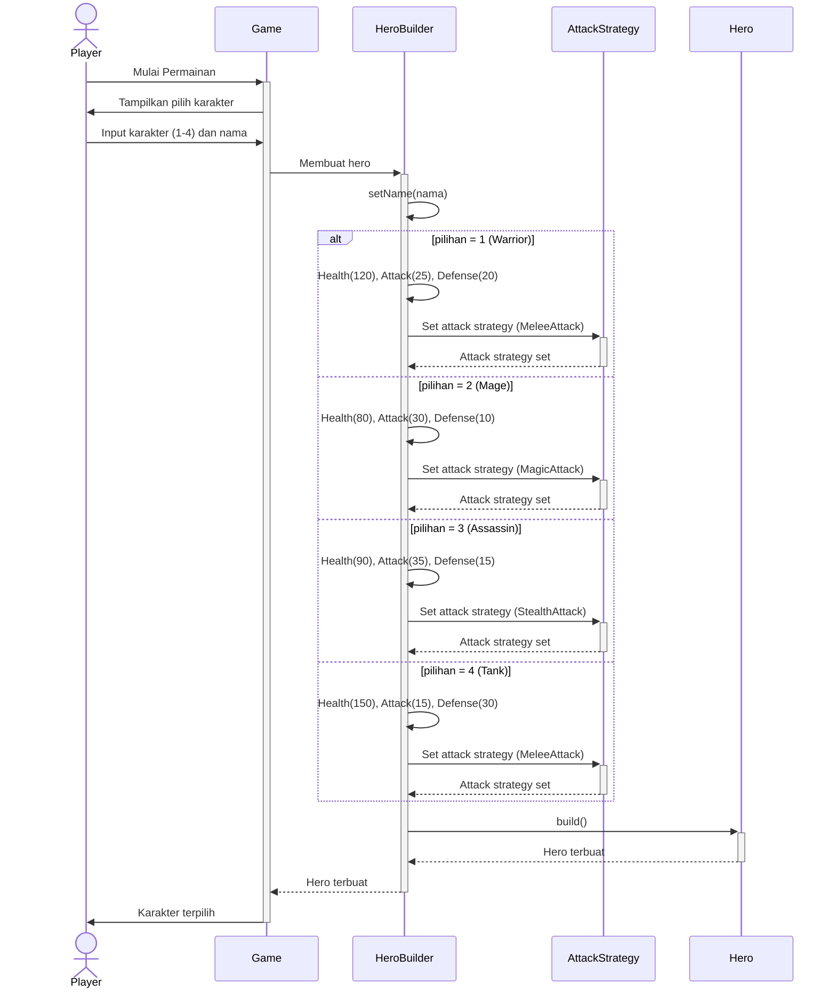

1. **Player Memulai Permainan**:
    - Pemain memulai permainan dengan memanggil`Mulai Permainan`pada`Game`.
2. **Game Menampilkan Pilihan Karakter**:
    - `Game`menampilkan pilihan karakter (Warrior, Mage, Assassin, Tank) kepada pemain.
3. **Player Memilih Karakter**:
    - Pemain memilih karakter (1-4) dan memasukkan nama.
4. **Game Meminta HeroBuilder Membuat Hero**:
    - `Game`meminta`HeroBuilder`untuk membuat karakter sesuai pilihan pemain.
5. **HeroBuilder Mengatur Atribut Karakter**:
    - `HeroBuilder`mengatur atribut karakter (`Health`,`Attack`,`Defense`) berdasarkan pilihan pemain.
6. **HeroBuilder Mengatur Attack Strategy**:
    - `HeroBuilder`mengatur strategi serangan (`AttackStrategy`) berdasarkan tipe karakter:
        - **Warrior**:`MeleeAttack`
        - **Mage**:`MagicAttack`
        - **Assassin**:`StealthAttack`
        - **Tank**:`MeleeAttack`
7. **HeroBuilder Membuat Hero**:
    - `HeroBuilder`memanggil metode`build()`untuk membuat objek`Hero`.
8. **HeroBuilder Mengembalikan Hero ke Game**:
    - `HeroBuilder`mengembalikan objek`Hero`yang sudah dibuat ke`Game`.
9. **Game Mengonfirmasi Karakter Terpilih**:
    - `Game`mengonfirmasi kepada pemain bahwa karakter telah berhasil dipilih.

### **Sequence Diagram: Dungeon Generation**

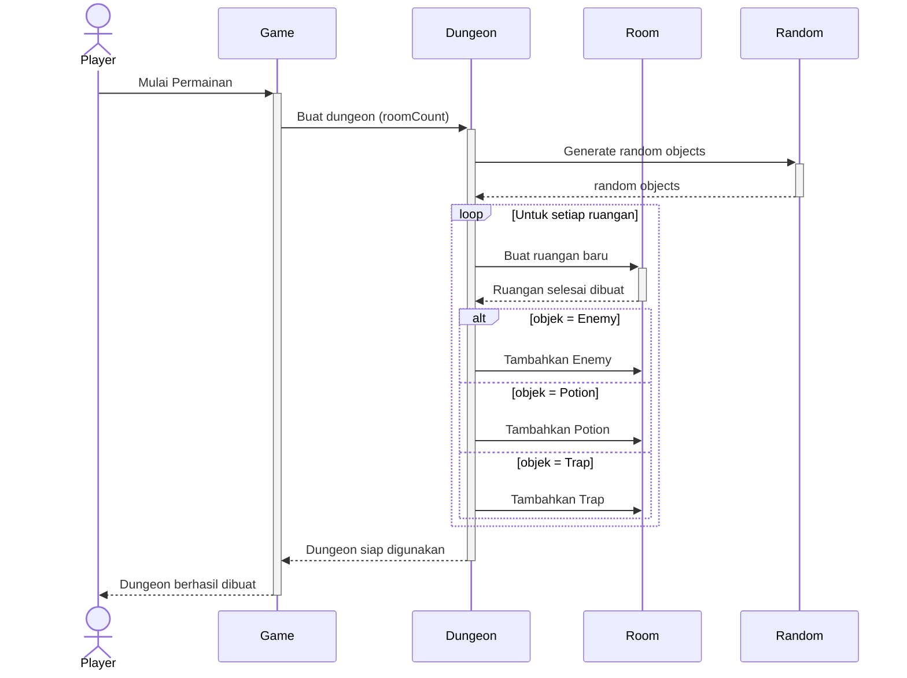

1. **Player Memulai Permainan**:
    - Pemain memulai permainan dengan memanggil`Mulai Permainan`pada`Game`.
2. **Game Meminta Dungeon Dibuat**:
    - `Game`meminta`Dungeon`untuk membuat dungeon dengan jumlah ruangan tertentu (`roomCount`).
3. **Dungeon Menggunakan Random untuk Generate Objek**:
    - `Dungeon`menggunakan`Random`untuk menghasilkan objek acak (musuh, potion, perangkap) di setiap ruangan.
    - `Random`mengembalikan objek acak ke`Dungeon`.
4. **Pembuatan Ruangan**:
    - Untuk setiap ruangan:
        - `Dungeon`membuat objek`Room`baru.
        - `Dungeon`menambahkan objek acak (`Enemy`,`Potion`, atau`Trap`) ke dalam ruangan.
5. **Dungeon Siap Digunakan**:
    - Setelah semua ruangan selesai dibuat,`Dungeon`mengembalikan dungeon yang siap digunakan ke`Game`.
6. **Game Mengonfirmasi Dungeon Berhasil Dibuat**:
    - `Game`mengonfirmasi kepada pemain bahwa dungeon telah berhasil dibuat.

### **Sequence Diagram: Combat**

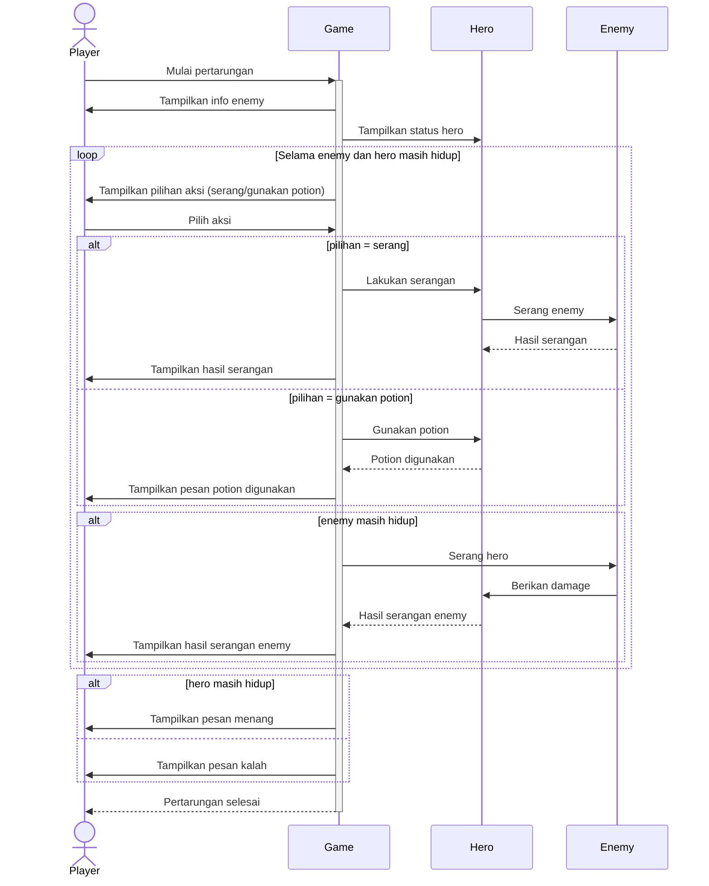

1. **Player Memulai Pertarungan**:
    - Pemain memulai pertarungan dengan memanggil`Mulai pertarungan`pada`Game`.
2. **Game Menampilkan Info Enemy dan Status Hero**:
    - `Game`menampilkan informasi tentang`Enemy`dan status`Hero`kepada pemain.
3. **Loop Pertarungan**:
    - Selama`Enemy`masih hidup dan`Hero`masih hidup:
        - `Game`menampilkan pilihan aksi kepada pemain (menyerang atau menggunakan potion).
        - Pemain memilih aksi.
4. **Jika Pemain Memilih Menyerang**:
    - `Game`meminta`Hero`untuk menyerang`Enemy`.
    - `Hero`menyerang`Enemy`dan mengembalikan hasil serangan.
    - `Game`menampilkan hasil serangan kepada pemain.
5. **Jika Pemain Memilih Menggunakan Potion**:
    - `Game`meminta`Hero`untuk menggunakan potion.
    - `Hero`menggunakan potion dan mengembalikan konfirmasi ke`Game`.
    - `Game`menampilkan pesan bahwa potion telah digunakan.
6. **Enemy Menyerang Balik**:
    - Jika`Enemy`masih hidup setelah serangan pemain,`Enemy`menyerang`Hero`.
    - `Enemy`memberikan damage kepada`Hero`dan mengembalikan hasil serangan ke`Game`.
    - `Game`menampilkan hasil serangan`Enemy`kepada pemain.
7. **Pengecekan Hasil Pertarungan**:
    - Jika`Hero`masih hidup setelah pertarungan,`Game`menampilkan pesan kemenangan.
    - Jika`Hero`kalah,`Game`menampilkan pesan kekalahan.
8. **Pertarungan Selesai**:
    - `Game`mengembalikan pesan bahwa pertarungan selesai kepada pemain.

### **Sequence Diagram: Explore Dungeon**

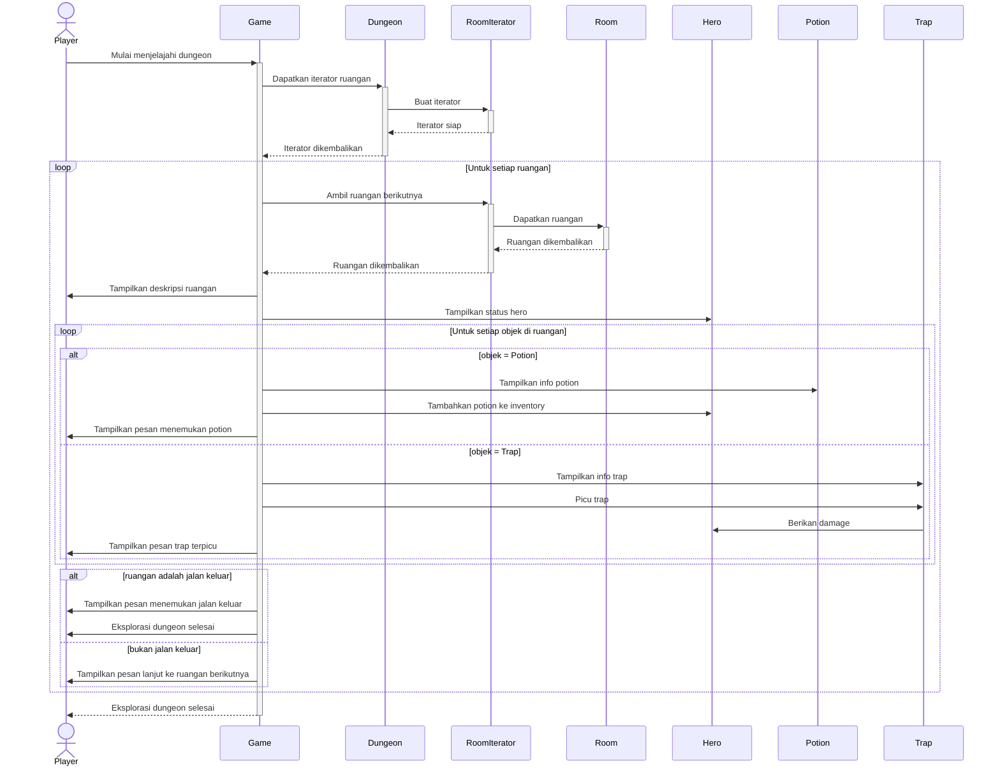

1. **Player Memulai Eksplorasi Dungeon**:
    - Pemain memulai eksplorasi dungeon dengan memanggil`Mulai menjelajahi dungeon`pada`Game`.
2. **Game Meminta Iterator Ruangan**:
    - `Game`meminta`Dungeon`untuk mendapatkan iterator ruangan.
3. **Dungeon Membuat Iterator**:
    - `Dungeon`membuat`RoomIterator`dan mengembalikannya ke`Game`.
4. **Iterasi Ruangan**:
    - Untuk setiap ruangan:
        - `Game`meminta`RoomIterator`untuk mengambil ruangan berikutnya.
        - `RoomIterator`mengembalikan`Room`ke`Game`.
        - `Game`menampilkan deskripsi ruangan dan status hero kepada pemain.
5. **Interaksi dengan Objek di Ruangan**:
    - Untuk setiap objek di ruangan:
        - Jika objek adalah`Potion`, potion ditambahkan ke inventory hero.
        - Jika objek adalah`Trap`, trap dipicu dan memberikan damage kepada hero.
6. **Pengecekan Jalan Keluar**:
    - Jika ruangan adalah jalan keluar, pemain mendapatkan pesan bahwa mereka menemukan jalan keluar.
    - Jika bukan, pemain melanjutkan ke ruangan berikutnya.
7. **Eksplorasi Selesai**:
    - Setelah semua ruangan selesai dijelajahi,`Game`mengembalikan pesan bahwa eksplorasi dungeon selesai.

--- 

## **Output Program**

