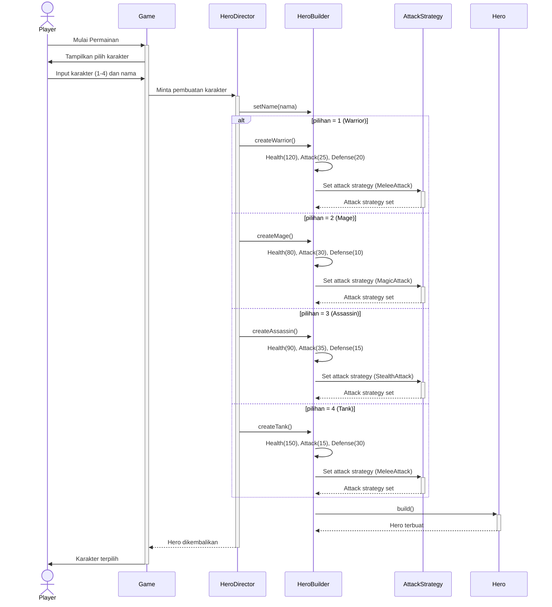
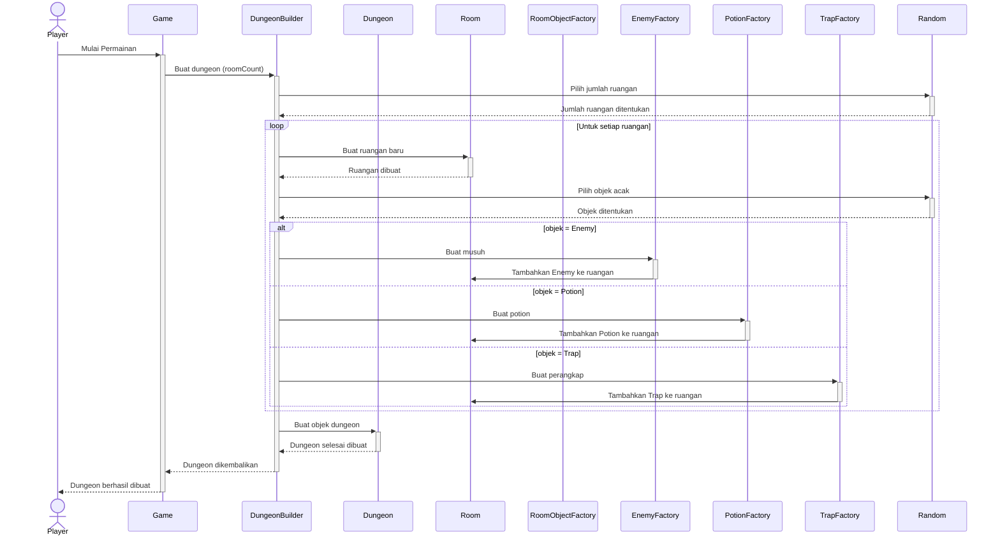
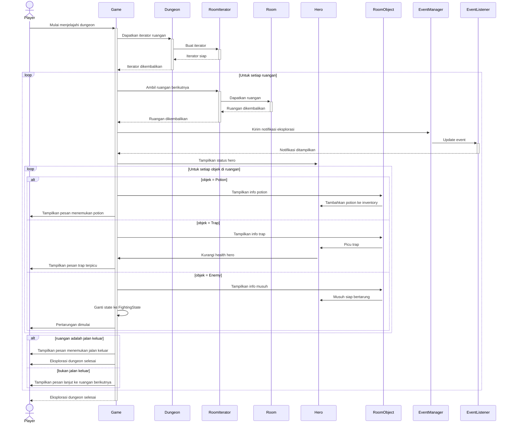
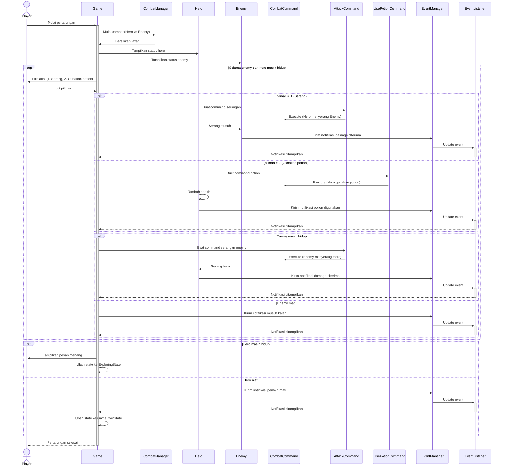
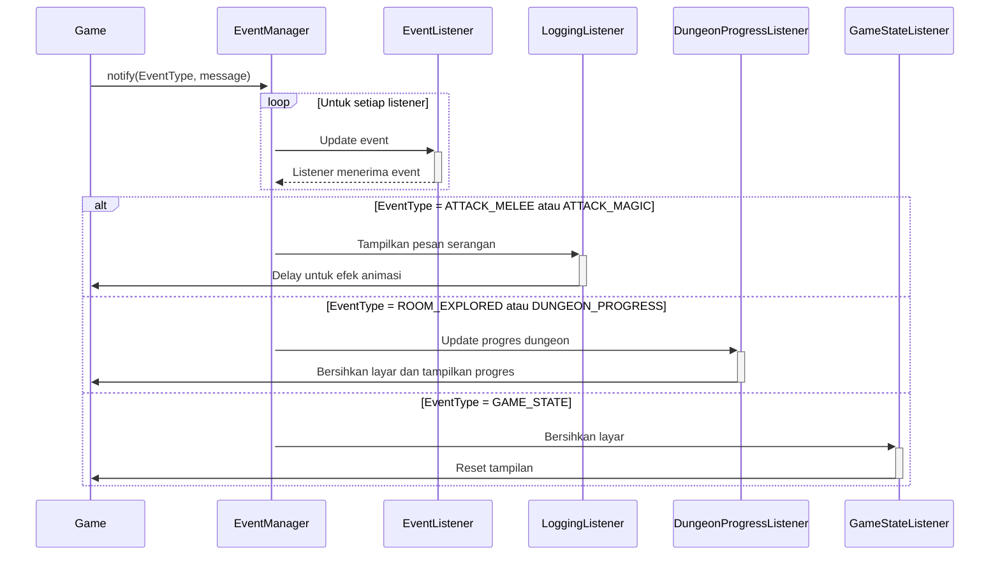
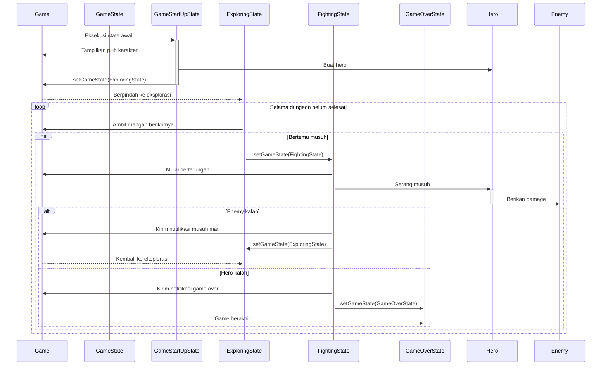
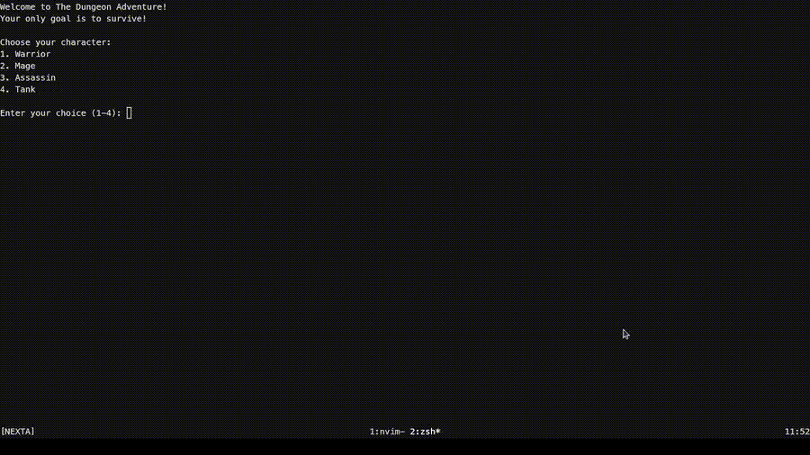

# Laporan Design Pattern
## Muhamad Saladin Eka Septian

Proyek ini bertujuan untuk mengimplementasikan berbagai Design
Pattern ([Creational](docs/creational.md), [Structural](docs/structural.md), dan [Behavioral](docs/behavioral.md)) dalam
satu aplikasi dengan menerapkannya
dalam sebuah game RPG Dungeon Crawler berbasis CLI. Game ini merupakan game RPG Dungeon Crawler di mana pemain dapat
memilih tipe karakter, menjelajahi dungeon yang dibuat
secara prosedural, dan bertarung melawan musuh, berinteraksi dengan berbagai
objek dalam ruangan, seperti musuh, perangkap, dan potion, serta menggunakan serangan yang sesuai dengan tipe karakter
yang dipilih.

Setiap karakter memiliki gaya bertarung nya masing masing, seperti serangan jarak
dekat, sihir, atau serangan tersembunyi. Musuh yang ditemui dalam dungeon memiliki perilaku yang berubah bergantung
pada kondisinya, seperti menyerang agresif, bertahan, atau melarikan diri. Pemain harus pintar pintar memilih aksi yang
tepat
untuk bertahan hidup dan menemukan jalan keluar dari dungeon.

### Menjalankan Aplikasi
```bash
# Compile dan jalankan program
$ javac -d out src/**/*.java
$ java -cp out Main
```

### **Use Case Diagram**


1. **Aktor**:
    - **Player**: Pemain yang mengontrol karakter dalam game.
2. **Use-Case Utama**:
    - **Choose Character**: Pemain memilih tipe karakter.
    - **Explore Dungeon**: Pemain menjelajahi dungeon.
3. **Use-Case yang Termasuk dalam Explore Dungeon**:
    - **Battle Enemy**: Pemain bertarung dengan musuh.
    - **Find Exit**: Pemain menemukan jalan keluar.
    - **Collect Potion**: Pemain mengumpulkan potion.
    - **Trigger Trap**: Pemain memicu perangkap.
4. **Use-Case yang Memperluas Battle Enemy**:
    - **Use Potion**: Pemain menggunakan potion selama pertarungan.
    - **Attack Enemy**: Pemain menyerang musuh selama pertarungan.

---

### **Class Diagram**

```mermaid
classDiagram
direction TB
    class Character {
        -String name
        -int health
        -int attackPower
        -int defense
        +performAttack(Character target) void
        +takeDamage(int damage) void
        +isAlive() bool
    }

    class Hero {
        -List~Potion~ inventory
        -AttackStrategy attackStrategy
        +setAttackStrategy(AttackStrategy strategy) void
        +usePotion() void
        +addPotion(Potion potion) void
    }

    class Enemy {
        -EnemyState state
        +setState(EnemyState state) void
        +performAttack(Character target) void
        +interact(Hero hero) void
    }

    class EnemyState {
        +execute(Enemy enemy, Hero hero) void
    }

    class AggressiveState {
        +execute(Enemy enemy, Hero hero) void
    }

    class DefensiveState {
        +execute(Enemy enemy, Hero hero) void
    }

    class FleeingState {
        +execute(Enemy enemy, Hero hero) void
    }

    class AttackStrategy {
        +attack(Character target) void
    }

    class MeleeAttack {
        +attack(Character target) void
    }

    class MagicAttack {
        +attack(Character target) void
    }

    class StealthAttack {
        +attack(Character target) void
    }

    class HeroBuilder {
        +setName(String name) void
        +setHealth(int health) void
        +setAttack(int attack) void
        +setDefense(int defense) void
        +setAttackStrategy(AttackStrategy strategy) void
        +build() Hero
    }

    class HeroDirector {
        +createWarrior() Hero
        +createMage() Hero
        +createAssassin() Hero
        +createTank() Hero
    }

    class Dungeon {
        -RoomIterator iterator
        +exploreNextRoom() void
        +isComplete() boolean
    }

    class DungeonBuilder {
        +setRoomCount(int count) DungeonBuilder
        +build() Dungeon
    }

    class RoomIterator {
        -List~Room~ rooms
        -int position
        +hasNext() boolean
        +next() Room
    }

    class Room {
        -String description
        -List~RoomObject~ objects
        +addObject(RoomObject object) void
        +getDescription() String
        +getObjects() List~RoomObject~
        +explore(Hero hero) void
    }

    class RoomObject {
        +interact(Hero hero) void
    }

    class Potion {
        +interact(Hero hero) void
    }

    class Trap {
        +interact(Hero hero) void
    }

    class RoomObjectFactory {
        +createObject() RoomObject
    }

    class EnemyFactory {
        +createObject() RoomObject
    }

    class PotionFactory {
        +createObject() RoomObject
    }

    class TrapFactory {
        +createObject() RoomObject
    }

    class CombatCommand {
        +execute(Character attacker, Character target) void
    }

    class AttackCommand {
        +execute(Character attacker, Character target) void
    }

    class UsePotionCommand {
        -Hero hero
        +execute(Character attacker, Character target) void
    }

    class CombatManager {
        +startCombat(Hero player, Enemy enemy) void
    }

    class Game {
        -static Game instance
        -static EventManager eventManager
        -Hero player
        -Dungeon dungeon
        -GameState gameState
        +getInstance() Game
        +start() void
        +setGameState(GameState state) void
    }

    class GameState {
        +execute(Game game) void
    }

    class GameStartupState {
        +execute(Game game) void
    }

    class ExploringState {
        +execute(Game game) void
    }

    class FightingState {
        -Enemy enemy
        -CombatManager combatManager
        +execute(Game game) void
    }

    class GameOverState {
        +execute(Game game) void
    }

    class EventManager {
        -List~EventListener~ listeners
        +subscribe(EventListener listener) void
        +unsubscribe(EventListener listener) void
        +notify(EventType type, String message) void
    }

    class EventListener {
        +update(EventType type, String message) void
    }

    class LoggingListener {
        +update(EventType type, String message) void
    }

    class GameStateListener {
        +update(EventType type, String message) void
    }

    class DungeonProgressListener {
        +update(EventType type, String message) void
    }

    <<abstract>> Character
    <<abstract>> RoomObject
    <<interface>> GameState
    <<interface>> EnemyState
    <<interface>> EventListener
    <<interface>> CombatCommand
    <<interface>> AttackStrategy
    <<interface>> RoomObjectFactory

    Character <|-- Hero
    Character <|-- Enemy
    Hero --> AttackStrategy : uses
    AttackStrategy <|.. MeleeAttack
    AttackStrategy <|.. MagicAttack
    AttackStrategy <|.. StealthAttack
    HeroBuilder --> Hero : builds
    HeroDirector --> HeroBuilder : directs
    Enemy --> EnemyState : has
    EnemyState <|.. AggressiveState
    EnemyState <|.. DefensiveState
    EnemyState <|.. FleeingState
    Game --> Hero : has
    Game --> Dungeon : has
    Game --> GameState : manages
    Game --> EventManager : has
    GameState <|.. GameStartupState
    GameState <|.. ExploringState
    GameState <|.. FightingState
    GameState <|.. GameOverState
    Dungeon --> RoomIterator : iterates through
    DungeonBuilder --> Dungeon : builds
    DungeonBuilder --> RoomObjectFactory : uses
    RoomIterator --> Room : iterates over
    Room --> RoomObject : contains
    RoomObject <|-- Enemy
    RoomObject <|-- Potion
    RoomObject <|-- Trap
    RoomObjectFactory <|-- EnemyFactory 
    RoomObjectFactory <|-- PotionFactory 
    RoomObjectFactory <|-- TrapFactory 
    EventManager --> EventListener : manages
    EventListener <|-- LoggingListener
    EventListener <|-- DungeonProgressListener
    EventListener <|-- GameStateListener
    CombatCommand <|-- AttackCommand
    CombatCommand <|-- UsePotionCommand
    CombatManager --> CombatCommand : executes
    CombatManager --> FightingState : uses
```



| **Kelas**                                                                             | **Atribut**                                                                                                                              | **Metode**                                                                                                                                                                                                                                              | **Deskripsi**                                                                                   |
|---------------------------------------------------------------------------------------|------------------------------------------------------------------------------------------------------------------------------------------|---------------------------------------------------------------------------------------------------------------------------------------------------------------------------------------------------------------------------------------------------------|-------------------------------------------------------------------------------------------------|
| `Character` *(abstract)*                                                              | `-String name`  <br>`-int health`  <br>`-int attackPower`  <br>`-int defense`                                                            | `+performAttack(Character target) void`  <br>`+takeDamage(int damage) void`  <br>`+isAlive() bool`  <br>`+getName() String`  <br>`+getHealth() int`  <br>`+getAttackPower() int`  <br>`+getDefense() int`                                               | Kelas abstrak yang merepresentasikan karakter dalam game (hero/musuh).                          |
| `Hero`                                                                                | `-List~Potion~ inventory`  <br>`-AttackStrategy attackStrategy`                                                                          | `+setAttackStrategy(AttackStrategy strategy) void`  <br>`+usePotion() void`  <br>`+addPotion(Potion potion) void`  <br>`+getPotionCount() int`  <br>`+performAttack(Character target) void`                                                             | Turunan dari `Character`, merepresentasikan hero yang dikendalikan pemain.                      |
| `Enemy`                                                                               | `-EnemyState state`                                                                                                                      | `+setState(EnemyState state) void`  <br>`+performAttack(Character target) void`  <br>`+interact(Hero hero) void`                                                                                                                                        | Turunan dari `Character`, merepresentasikan musuh dengan perilaku AI yang berubah-ubah.         |
| `EnemyState` *(interface)*                                                            | -                                                                                                                                        | `+execute(Enemy enemy, Hero hero) void`                                                                                                                                                                                                                 | Interface untuk berbagai perilaku AI musuh.                                                     |
| `AggressiveState` <br> `DefensiveState` <br> `FleeingState`                           | -                                                                                                                                        | `+execute(Enemy enemy, Hero hero) void`                                                                                                                                                                                                                 | Implementasi dari `EnemyState`, menentukan cara musuh bertindak dalam pertempuran.              |
| `AttackStrategy` *(interface)*                                                        | -                                                                                                                                        | `+attack(Character target) void`                                                                                                                                                                                                                        | Interface untuk strategi serangan hero.                                                         |
| `StealthAttack`  <br>`MagicAttack`  <br>`MeleeAttack`                                 | -                                                                                                                                        | `+attack(Character target) void`                                                                                                                                                                                                                        | Implementasi strategi serangan hero.                                                            |
| `HeroBuilder`                                                                         | `-String name`  <br>`-int health`  <br>`-int attackPower`  <br>`-int defense`                                                            | `+setName(String name) HeroBuilder`  <br>`+setHealth(int health) HeroBuilder`  <br>`+setAttack(int attack) HeroBuilder`  <br>`+setDefense(int defense) HeroBuilder`  <br>`+setAttackStrategy(AttackStrategy strategy) HeroBuilder`  <br>`+build() Hero` | Builder untuk membuat objek `Hero` dengan atribut yang dapat dikonfigurasi.                     |
| `HeroDirector`                                                                        | -                                                                                                                                        | `+createWarrior() Hero`  <br>`+createMage() Hero`  <br>`+createAssassin() Hero`  <br>`+createTank() Hero`                                                                                                                                               | Mengarahkan pembuatan hero berdasarkan kelas karakter yang sudah ditentukan.                    |
| `Dungeon`                                                                             | `-RoomIterator iterator`                                                                                                                 | `+exploreNextRoom() void`  <br>`+isComplete() boolean`                                                                                                                                                                                                  | Dungeon tempat hero menjelajah, terdiri dari beberapa ruangan.                                  |
| `DungeonBuilder`                                                                      | `-int roomCount`                                                                                                                         | `+setRoomCount(int count) DungeonBuilder`  <br>`+build() Dungeon`                                                                                                                                                                                       | Builder untuk membuat dungeon dengan jumlah ruangan yang dapat dikonfigurasi.                   |
| `RoomIterator`                                                                        | `-List~Room~ rooms`  <br>`-int position`                                                                                                 | `+hasNext() boolean`  <br>`+next() Room`                                                                                                                                                                                                                | Iterator untuk menavigasi ruangan dalam dungeon.                                                |
| `Room`                                                                                | `-String description`  <br>`-List~RoomObject~ objects`                                                                                   | `+addObject(RoomObject object) void`  <br>`+getDescription() String`  <br>`+getObjects() List~RoomObject~`  <br>`+explore(Hero hero) void`                                                                                                              | Representasi ruangan dalam dungeon yang berisi objek interaktif.                                |
| `RoomObject` *(abstract)*                                                             | -                                                                                                                                        | `+interact(Hero hero) void`                                                                                                                                                                                                                             | Kelas abstrak untuk objek yang ada dalam ruangan (musuh, potion, perangkap).                    |
| `Potion`                                                                              | -                                                                                                                                        | `+interact(Hero hero) void`                                                                                                                                                                                                                             | Potion yang dapat digunakan oleh hero untuk memulihkan kesehatan.                               |
| `Trap`                                                                                | -                                                                                                                                        | `+interact(Hero hero) void`                                                                                                                                                                                                                             | Perangkap yang memberikan damage kepada hero jika terpicu.                                      |
| `RoomObjectFactory` *(interface)*                                                     | -                                                                                                                                        | `+createObject() RoomObject`                                                                                                                                                                                                                            | Interface untuk pembuatan objek dalam ruangan secara dinamis.                                   |
| `EnemyFactory`  <br> `PotionFactory`  <br> `TrapFactory`                              | -                                                                                                                                        | `+createObject() RoomObject`                                                                                                                                                                                                                            | Implementasi dari `RoomObjectFactory` untuk membuat objek musuh, potion, atau perangkap.        |
| `CombatCommand` *(interface)*                                                         | -                                                                                                                                        | `+execute(Character attacker, Character target) void`                                                                                                                                                                                                   | Interface untuk command yang digunakan dalam pertempuran.                                       |
| `AttackCommand`  <br> `UsePotionCommand`                                              | -                                                                                                                                        | `+execute(Character attacker, Character target) void`                                                                                                                                                                                                   | Implementasi dari `CombatCommand` untuk menyerang atau menggunakan potion dalam pertempuran.    |
| `CombatManager`                                                                       | -                                                                                                                                        | `+startCombat(Hero player, Enemy enemy) void`                                                                                                                                                                                                           | Mengatur jalannya pertempuran antara hero dan musuh.                                            |
| `Game` *(Singleton)*                                                                  | `-static Game instance`  <br>`-static EventManager eventManager`  <br>`-Hero player`  <br>`-Dungeon dungeon`  <br>`-GameState gameState` | `+getInstance() Game`  <br>`+start() void`  <br>`+setGameState(GameState state) void`                                                                                                                                                                   | Kelas utama yang mengatur alur permainan, menggunakan pola singleton.                           |
| `GameState` *(interface)*                                                             | -                                                                                                                                        | `+execute(Game game) void`                                                                                                                                                                                                                              | Interface untuk berbagai state dalam game.                                                      |
| `GameStartupState`  <br> `ExploringState`  <br> `FightingState`  <br> `GameOverState` | -                                                                                                                                        | `+execute(Game game) void`                                                                                                                                                                                                                              | Implementasi dari `GameState`, menangani perubahan status game.                                 |
| `EventManager`                                                                        | `-List~EventListener~ listeners`                                                                                                         | `+subscribe(EventListener listener) void`  <br>`+unsubscribe(EventListener listener) void`  <br>`+notify(EventType type, String message) void`                                                                                                          | Mengelola event listener dan notifikasi dalam game.                                             |
| `EventListener` *(interface)*                                                         | -                                                                                                                                        | `+update(EventType type, String message) void`                                                                                                                                                                                                          | Interface untuk listener yang merespons event dalam game.                                       |
| `LoggingListener`  <br> `GameStateListener`  <br> `DungeonProgressListener`           | -                                                                                                                                        | `+update(EventType type, String message) void`                                                                                                                                                                                                          | Implementasi dari `EventListener`, mencatat log, memantau state game, dan perkembangan dungeon. |

---

---

### **Sequence Diagram: Choose Character**



- **Player Memulai Permainan**
    - Pemain memulai permainan dengan memanggil `Mulai Permainan` pada `Game`.
- **Game Menampilkan Pilihan Karakter**
    - `Game` menampilkan pilihan karakter (`Warrior`, `Mage`, `Assassin`, `Tank`).
- **Player Memilih Karakter**
    - Pemain memilih karakter (1-4) dan memasukkan nama.
- **Game Meminta `HeroDirector` untuk Membuat Karakter**
    - `Game` mengirimkan pilihan karakter ke `HeroDirector`, yang bertanggung jawab mengatur proses pembuatan karakter.
- **HeroDirector Menggunakan `HeroBuilder`**
    - `HeroDirector` memanggil metode builder yang sesuai untuk membuat karakter berdasarkan pilihan pemain.
- **HeroBuilder Mengatur Atribut Hero**
    - `HeroBuilder` mengatur `health`, `attack`, `defense`, dan `attack strategy` berdasarkan tipe hero.
- **HeroBuilder Membuat Hero**
    - `HeroBuilder` memanggil metode `build()` untuk membuat objek `Hero`.
- **HeroDirector Mengembalikan Hero ke Game**
    - `HeroDirector` mengembalikan objek `Hero` ke `Game`.
- **Game Mengonfirmasi Karakter Terpilih**
    - `Game` mengonfirmasi kepada pemain bahwa karakter telah berhasil dipilih.

---

### **Sequence Diagram: Dungeon Generation**



- **Player Memulai Permainan**
    - Pemain memulai permainan, dan `Game` meminta `DungeonBuilder` untuk membuat dungeon.
- **DungeonBuilder Menentukan Jumlah Ruangan**
    - `DungeonBuilder` menggunakan `Random` untuk menentukan jumlah ruangan berdasarkan `roomCount`.
- **Loop: Membuat Setiap Ruangan**
    - Untuk setiap ruangan:
        - `DungeonBuilder` membuat objek `Room`.
        - `DungeonBuilder` menggunakan `Random` untuk menentukan objek acak dalam ruangan (`Enemy`, `Potion`, atau
          `Trap`).
- **Menggunakan Factory Method untuk Membuat Objek dalam Ruangan**
    - Jika objek adalah **musuh**, `EnemyFactory` akan membuat musuh dan menambahkannya ke ruangan.
    - Jika objek adalah **potion**, `PotionFactory` akan membuat potion dan menambahkannya ke ruangan.
    - Jika objek adalah **perangkap**, `TrapFactory` akan membuat trap dan menambahkannya ke ruangan.
- **Dungeon Dibuat dan Dikembalikan ke Game**
    - Setelah semua ruangan selesai dibuat, `DungeonBuilder` membuat objek `Dungeon` dan mengembalikannya ke `Game`.
    - `Game` memberi tahu `Player` bahwa dungeon telah berhasil dibuat.

---

### **Sequence Diagram: Explore Dungeon**



- **Player Memulai Eksplorasi Dungeon**
    - Pemain memulai eksplorasi dungeon, dan `Game` meminta `Dungeon` untuk mendapatkan iterator ruangan.
- **Dungeon Membuat `RoomIterator`**
    - `Dungeon` membuat iterator (`RoomIterator`) untuk menavigasi daftar ruangan.
- **Loop: Menjelajahi Setiap Ruangan**
    - `Game` meminta iterator (`RoomIterator`) untuk mendapatkan ruangan berikutnya.
    - `RoomIterator` mengembalikan ruangan saat ini ke `Game`.
- **Observer Pattern untuk Notifikasi**
    - `Game` mengirim notifikasi `ROOM_EXPLORED` ke `EventManager`.
    - `EventManager` memberitahu semua `EventListener`, yang akan menampilkan pesan eksplorasi kepada pemain.
- **Tampilkan Status Hero**
    - `Game` menampilkan status hero kepada pemain.
- **Loop: Berinteraksi dengan Objek di Ruangan**
    - Jika objek adalah **Potion**, hero menambahkannya ke inventory.
    - Jika objek adalah **Trap**, trap terpicu dan mengurangi health hero.
    - Jika objek adalah **Enemy**, `Game` mengubah state ke `FightingState`, dan pertarungan dimulai.
- **Pengecekan Jalan Keluar**
    - Jika ruangan adalah jalan keluar, pemain mendapatkan pesan bahwa mereka menemukan jalan keluar.
    - Jika bukan, pemain melanjutkan ke ruangan berikutnya.
- **Eksplorasi Selesai**
    - Setelah semua ruangan selesai dijelajahi, `Game` memberi tahu `Player` bahwa eksplorasi dungeon selesai.

---

### **Sequence Diagram: Combat**



- **Player Memulai Pertarungan**
    - Pemain memulai pertarungan, dan `Game` mengaktifkan `CombatManager`.
    - `CombatManager` membersihkan layar dan menampilkan status hero dan musuh.
- **Loop: Selama Pertarungan Berlangsung**
    - `Game` meminta pemain memilih aksi (`1. Serang` atau `2. Gunakan Potion`).
- **Jika Pemain Memilih Menyerang**
    - `Game` membuat `AttackCommand`.
    - `AttackCommand.execute()` memanggil metode `performAttack()` pada `Hero`.
    - `Hero` menyerang `Enemy` dan mengurangi health musuh.
    - `Game` mengirim notifikasi damage melalui `EventManager`.
    - `EventListener` menampilkan notifikasi kepada pemain.
- **Jika Pemain Memilih Menggunakan Potion**
    - `Game` membuat `UsePotionCommand`.
    - `UsePotionCommand.execute()` memanggil metode `usePotion()` pada `Hero`.
    - `Hero` menggunakan potion dan menambah health.
    - `Game` mengirim notifikasi penggunaan potion melalui `EventManager`.
- **Enemy Menyerang Balik**
    - Jika `Enemy` masih hidup, `Game` membuat `AttackCommand` untuk musuh.
    - `AttackCommand.execute()` memanggil metode `performAttack()` pada `Enemy`.
    - `Enemy` menyerang `Hero`, dan `Game` mengirim notifikasi damage.
- **Jika Musuh Mati**
    - `Game` mengirim notifikasi bahwa musuh telah dikalahkan.
    - `Game` kembali ke `ExploringState`.
- **Jika Hero Mati**
    - `Game` mengirim notifikasi bahwa pemain kalah.
    - `Game` mengganti state ke `GameOverState`.
- **Pertarungan Selesai**
    - `Game` mengakhiri pertarungan dan menampilkan hasil kepada pemain.

---

### **Sequence Diagram: Event System**



- **Game Mengirim Event**
    - `Game.notify(EventType, message)` memanggil `EventManager`.
- **EventManager Memberi Tahu Semua Listener**
    - `EventManager` mengiterasi semua listener yang terdaftar dan memanggil `update()`.
- **Masing-masing Listener Memproses Event**
    - Jika event adalah **serangan melee atau magic**, `LoggingListener` akan menampilkan pesan dengan efek delay.
    - Jika event adalah **eksplorasi ruangan atau progres dungeon**, `DungeonProgressListener` akan membersihkan layar
      dan menampilkan progres.
    - Jika event adalah **perubahan state game**, `GameStateListener` akan membersihkan layar agar UI tetap rapi.

---

### **Sequence Diagram: State Management**



---

## **Output Program**



