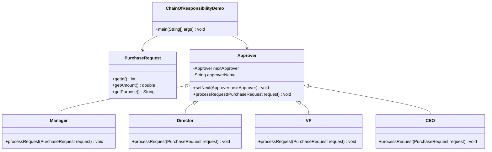

## **Strategy Pattern**

Strategy Pattern adalah sebuah pola desain yang memungkinkan Anda untuk mendefinisikan sekumpulan algoritma, mengemas
masing-masing algoritma tersebut ke dalam kelas terpisah, dan membuatnya dapat dipertukarkan. Pola ini memungkinkan
algoritma untuk bervariasi secara independen dari klien yang menggunakannya.

### **Struktur Kelas Strategy Pattern**

Dalam proyek ini, Strategy Pattern digunakan untuk mengimplementasikan berbagai strategi serangan yang dapat digunakan
oleh karakter hero. Setiap strategi serangan dienkapsulasi dalam kelas terpisah, seperti`MeleeAttack`,`MagicAttack`, dan
`StealthAttack`.

`Hero`memiliki atribut`AttackStrategy`yang dapat diatur menggunakan metode`setAttackStrategy()`. Ketika hero menyerang,
metode`performAttack()`akan memanggil strategi serangan yang sedang aktif. Ini memungkinkan hero untuk memiliki berbagai
gaya bertarung yang dapat diubah sesuai kebutuhan

---

## **Iterator Pattern**

Iterator Pattern digunakan untuk menyediakan cara untuk mengakses elemen dalam koleksi secara berurutan tanpa harus
mengetahui detail implementasi dari koleksi tersebut.

### **Struktur Kelas Iterator Pattern**

Iterator Pattern digunakan untuk memungkinkan eksplorasi ruangan dalam dungeon secara berurutan. `RoomIterator`
bertanggung jawab untuk mengelola iterasi melalui list `Room` di dalam `Dungeon`. `Dungeon` sendiri bertindak sebagai
koleksi yang menggunakan iterator untuk menjelajahi ruangan satu per satu.

Dungeon memiliki atribut `RoomIterator`, yang digunakan untuk menjelajahi setiap ruangan. Metode `exploreNextRoom()`
akan mengambil ruangan berikutnya dari iterator, kemudian menjalankan metode `explore()` pada ruangan tersebut.
`isComplete()` akan mengecek apakah masih ada ruangan yang tersisa untuk dijelajahi. Dengan pola ini, traversal dungeon
menjadi lebih fleksibel dan dapat dikelola dengan baik.

---

## **Observer Pattern**

Observer Pattern digunakan untuk menghubungkan sekumpulan objek sehingga ketika satu objek berubah, objek lain yang
bergantung padanya akan diberi tahu secara otomatis. Pola ini cocok untuk menangani notifikasi dalam game, seperti
pemberitahuan saat pemain menerima damage, menemukan item, atau menjelajahi ruangan baru.

### **Struktur Kelas Observer Pattern**

Observer Pattern digunakan untuk menangani berbagai notifikasi dalam game. `EventManager` bertindak sebagai **subject**
yang mengelola daftar observer. Saat sebuah peristiwa terjadi, `EventManager` akan memberi tahu semua observer yang
terdaftar. Beberapa observer yang digunakan adalah `LoggingListener`, `DungeonProgressListener`, dan
`GameStateListener`.

`EventManager` mengelola daftar observer dan menyediakan metode `subscribe()`, `unsubscribe()`, serta `notify()`.
`LoggingListener` bertanggung jawab untuk mencetak log peristiwa ke terminal dengan efek jeda untuk meningkatkan pacing
dari game. `DungeonProgressListener` digunakan untuk melacak perkembangan eksplorasi dungeon, sementara
`GameStateListener` menangani perubahan status permainan dan memperbarui tampilan saat state berubah.

---

## **Command Pattern**

Command Pattern digunakan untuk mengenkapsulasi permintaan sebagai objek, memungkinkan pemisahan antara pengirim
perintah dan eksekusinya. Pola ini mempermudah implementasi fitur seperti undo, log aksi, dan eksekusi perintah yang
lebih fleksibel.

### **Struktur Kelas Command Pattern**

Command Pattern digunakan untuk mengelola aksi dalam sistem pertarungan. `CombatCommand` bertindak sebagai antarmuka
untuk semua perintah, sementara `AttackCommand` dan `UsePotionCommand` adalah implementasi spesifik yang menangani
serangan dan penggunaan potion dalam pertempuran.

Dalam implementasinya, `CombatManager` menerima input pemain dan mengeksekusi perintah yang sesuai. `AttackCommand`
meminta karakter untuk menyerang lawan, sementara `UsePotionCommand` memungkinkan hero menggunakan potion dari
inventorinya.

---

## **State Pattern**

State Pattern digunakan untuk mengizinkan sebuah objek mengubah perilakunya ketika state internalnya berubah. Pola ini
memungkinkan setiap state memiliki implementasi yang berbeda tanpa harus menggunakan banyak pernyataan pengkondisian.

### **Struktur Kelas State Pattern**

State Pattern digunakan untuk mengatur status permainan (`GameState`) dan perilaku musuh (`EnemyState`). `GameState`
mengontrol perubahan status dalam permainan, seperti memulai, menjelajah dungeon, bertarung, dan menyelesaikan
permainan. `EnemyState` mengontrol perilaku musuh berdasarkan kondisinya, seperti agresif, defensif, atau melarikan
diri.

Dalam implementasinya, `Game` memiliki atribut `gameState`, yang bisa berubah saat permainan berlangsung. Metode
`setGameState()` digunakan untuk mengubah state saat pemain berpindah dari satu fase permainan ke fase lainnya. `Enemy`
memiliki atribut `state`, yang menentukan bagaimana musuh bertindak dalam pertempuran. Jika kesehatan musuh rendah,
state dapat berubah dari `AggressiveState` ke `DefensiveState` atau `FleeingState`.

---

## **Chain of Responsibility Pattern**

Chain of Responsibility Pattern adalah pola desain yang memungkinkan permintaan ditangani oleh serangkaian objek
penerima. Pola ini berguna untuk menghindari pengirim permintaan mengetahui penerima yang tepat, sehingga memungkinkan
penerima untuk diproses secara dinamis.

### **Struktur Kelas Chain of Responsibility Pattern**

Dalam implementasi ini, Chain of Responsibility Pattern digunakan untuk menangani permintaan pembelian berdasarkan
jumlahnya. `PurchaseRequest` adalah kelas permintaan, `Approver` adalah kelas abstrak untuk penangan permintaan, dan
`Manager`, `Director`, `VP`, serta `CEO` adalah kelas konkret yang menangani permintaan berdasarkan batasan jumlah yang
telah ditentukan.

Dalam implementasinya, `ChainOfResponsibilityDemo` membuat rantai penanganan permintaan dengan menghubungkan `Manager`,
`Director`, `VP`, dan `CEO`. Setiap permintaan pembelian diproses oleh penangan yang sesuai berdasarkan jumlahnya. Jika
penangan tidak dapat menyetujui permintaan, permintaan akan diteruskan ke penangan berikutnya dalam rantai.

---

## **Mediator Pattern**

Mediator Pattern adalah pola desain yang memungkinkan komunikasi antar objek dalam sistem melalui objek mediator. Pola
ini berguna untuk mengurangi kompleksitas komunikasi langsung antar objek dan memfasilitasi pengelolaan interaksi antar
objek.

### **Struktur Kelas Mediator Pattern**

Dalam implementasi ini, Mediator Pattern digunakan untuk mengelola komunikasi dalam chat room. `ChatMediator` adalah
antarmuka mediator, `ChatRoom` adalah mediator konkret, dan `User` adalah kelas abstrak untuk pengguna. `RegularUser`,
`PremiumUser`, dan `AdminUser` adalah kelas konkret yang mewakili berbagai jenis pengguna dalam ruang obrolan.

Dalam implementasinya, `ChatRoom` mengelola daftar pengguna dan mendistribusikan pesan yang diterima dari satu pengguna
ke semua pengguna lain dalam ruang obrolan. `RegularUser`, `PremiumUser`, dan `AdminUser` memiliki metode `send` dan
`receive` untuk mengirim dan menerima pesan. `PremiumUser` dan `AdminUser` memiliki metode tambahan untuk mengirim pesan
prioritas dan pesan sistem. Pendekatan ini memisahkan logika komunikasi dari pengguna individu dan memusatkannya dalam
mediator.

---

## **Visitor Pattern**

Visitor Pattern adalah pola desain yang memungkinkan penambahkan operasi ke objek tanpa mengubah struktur objek
tersebut. Pola ini berguna untuk memisahkan algoritma dari struktur objek yang dioperasikan.

### **Struktur Kelas Visitor Pattern**

Dalam implementasi ini, Visitor Pattern digunakan untuk menghitung area, menghitung perimeter, dan mengekspor bentuk ke
XML. `Visitor` adalah antarmuka untuk pengunjung, `AreaCalculator`, `PerimeterCalculator`, dan `XMLExportVisitor` adalah
pengunjung konkret. `Shape` adalah antarmuka untuk bentuk, dan `Circle`, `Rectangle`, serta `Triangle` adalah bentuk
konkret.

Dalam implementasinya, `Drawing` menyimpan daftar `Shape`, yang bisa berupa `Circle`, `Rectangle`, atau `Triangle`.
`AreaCalculator`, `PerimeterCalculator`, dan `XMLExportVisitor` mengunjungi setiap bentuk untuk menghitung area,
menghitung perimeter, dan mengekspor ke XML. Pendekatan ini memungkinkan penambahan operasi baru tanpa mengubah struktur
kelasnya.

---

## **Template Method Pattern**

Template Method Pattern adalah pola desain yang mendefinisikan kerangka algoritma dalam metode di kelas dasar, tetapi
memungkinkan subclass untuk mengisi langkah-langkah tertentu dari algoritma tersebut. Pola ini berguna untuk
mendefinisikan struktur umum dari algoritma sambil membiarkan detail implementasi bervariasi.

### **Struktur Kelas Template Method Pattern**

Dalam implementasi ini, Template Method Pattern digunakan untuk mendefinisikan perilaku karakter dalam permainan.
`GameCharacterAI` adalah kelas abstrak yang mendefinisikan kerangka algoritma untuk siklus perilaku karakter.
`AggressiveEnemyAI`, `SupportCharacterAI`, dan `StealthCharacterAI` adalah kelas konkret yang mengisi langkah-langkah
spesifik dari algoritma tersebut.

Dalam implementasinya, `GameCharacterAI` mendefinisikan metode `executeTurn` yang merupakan kerangka algoritma untuk
siklus perilaku karakter. Metode ini memanggil beberapa metode abstrak seperti `evaluateThreats`, `choosePrimaryTarget`,
dan `selectAction` yang diimplementasikan oleh subclass. `AggressiveEnemyAI`, `SupportCharacterAI`, dan
`StealthCharacterAI` mengisi langkah-langkah spesifik dari algoritma tersebut sesuai dengan perilaku karakter
masing-masing.

---
## **Memento Pattern**

Memento Pattern adalah pola desain yang memungkinkan Anda untuk menangkap dan mengeksternalisasi keadaan internal suatu
objek sehingga dapat dipulihkan nanti tanpa melanggar enkapsulasi. Pola ini berguna untuk mengimplementasikan fungsi
undo dan redo.

### **Struktur Kelas Memento Pattern**

Dalam implementasi ini, Memento Pattern digunakan untuk mengelola keadaan editor teks. `TextEditor` adalah kelas
originator yang membuat memento untuk menyimpan keadaannya. `EditorMemento` adalah kelas memento yang menyimpan keadaan.
`History` adalah kelas caretaker yang mengelola memento untuk operasi undo dan redo.

Dalam implementasinya, `TextEditor` memiliki metode untuk menulis, menghapus, memilih teks, dan memindahkan kursor. Ia
dapat membuat dan memulihkan memento untuk menyimpan dan mengembalikan keadaannya. `History` mengelola memento untuk
operasi undo dan redo. `MementoPatternDemo` mendemonstrasikan penggunaan Memento Pattern dengan melakukan berbagai
operasi pada editor teks dan mengelola keadaannya menggunakan history.