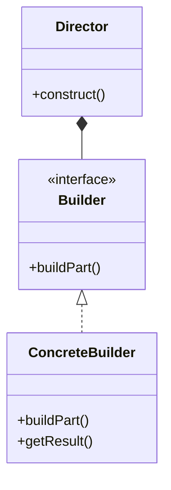
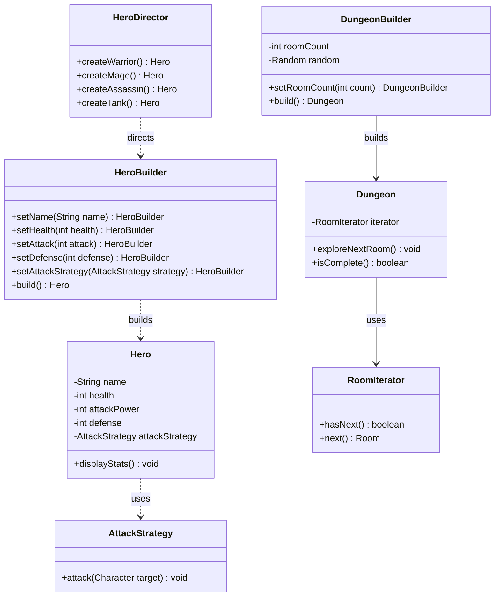
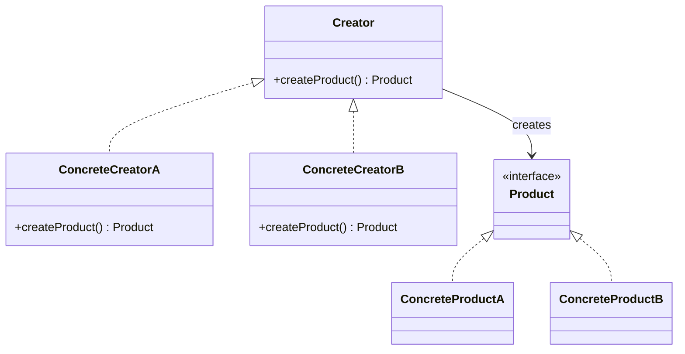
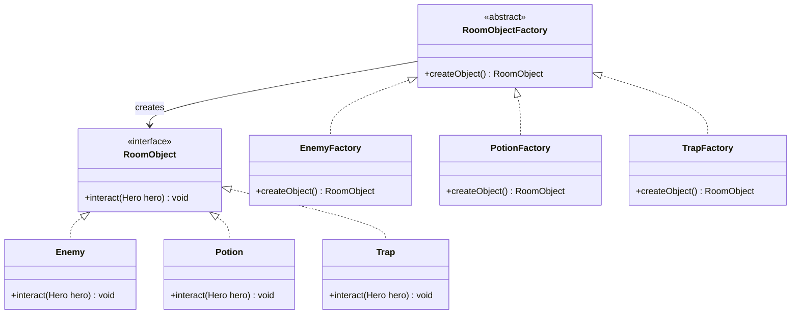
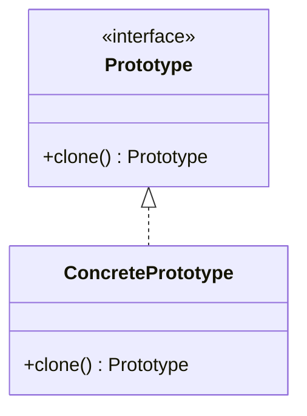
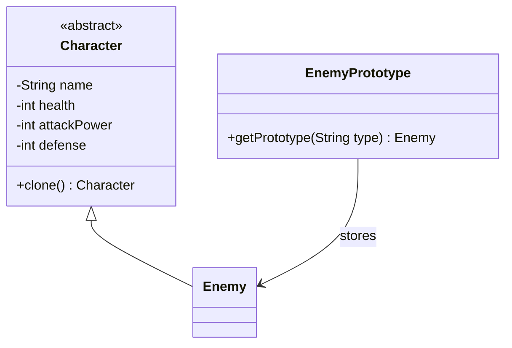
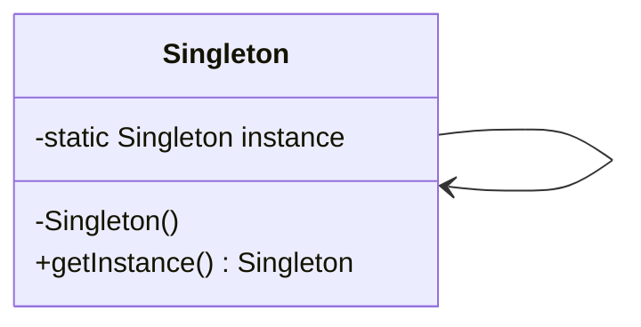
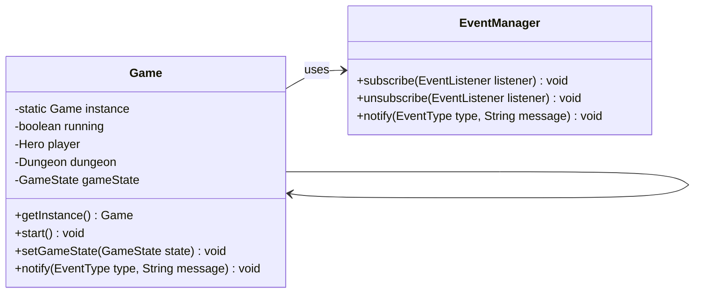
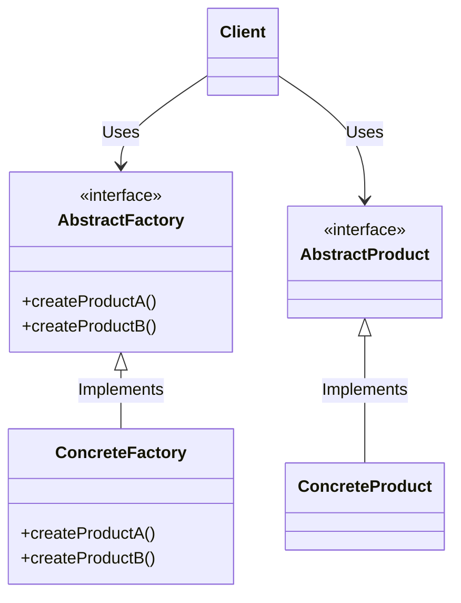
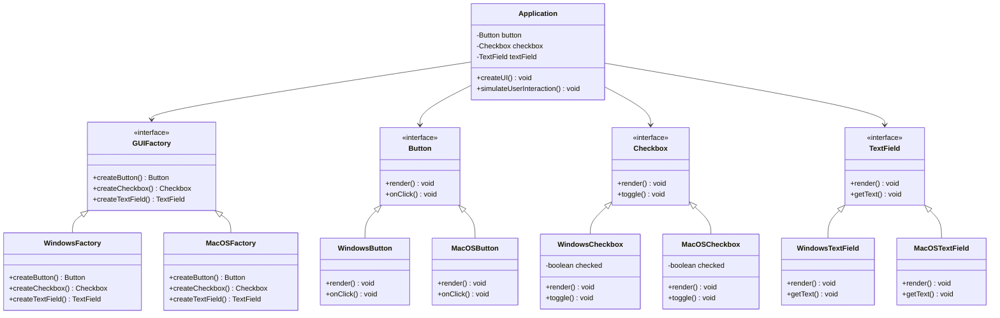

## **Builder Pattern**

Builder Pattern digunakan untuk memisahkan proses konstruksi objek yang kompleks dari representasinya sehingga proses
pembuatan yang sama dapat menghasilkan bentuk yang berbeda.

### **Struktur Kelas Builder Pattern**

Builder Pattern digunakan untuk membangun hero dan dungeon. `HeroBuilder` digunakan untuk membuat hero dengan cara
menetapkan atribut seperti nama, health, attack, defense, serta strategi serangan sebelum akhirnya hero dibuat dengan
metode `build()`. `HeroDirector` berperan sebagai pengarah yang menyediakan metode pembuatan hero sesuai dengan
kelasnya, seperti Warrior, Mage, Assassin, dan Tank, tanpa perlu mengatur atributnya secara manual setiap kali membuat
hero baru.

Pembuatan dungeon menggunakan `DungeonBuilder`, yang bertanggung jawab untuk membentuk dungeon dengan sejumlah ruangan
dan mengisi setiap ruangan dengan objek secara acak. `DungeonBuilder` memiliki metode `setRoomCount()` untuk menentukan
jumlah ruangan sebelum akhirnya dipanggil `build()` untuk membuat dungeon. Dungeon yang dihasilkan akan memiliki
sekumpulan `Room` yang disusun dalam `iterator` sehingga pemain dapat menjelajahinya satu per satu.

---

## **Factory Method Pattern**

Factory Method Pattern digunakan untuk mendefinisikan antarmuka dalam pembuatan objek, tetapi memungkinkan subclass yang
menentukan kelas mana yang akan diinstansiasi. Pola ini digunakan ketika kelas tidak dapat menentukan objek mana yang
harus dibuat pada saat kompilasi dan menyerahkan keputusan ini kepada subclass.

### **Struktur Kelas Factory Method Pattern**

Factory Method Pattern digunakan untuk membuat objek dalam dungeon secara dinamis. `RoomObjectFactory` adalah kelas
abstrak yang berfungsi sebagai pabrik, sedangkan `EnemyFactory`, `PotionFactory`, dan `TrapFactory` bertindak sebagai
subclass yang menghasilkan objek sesuai dengan tipe masing-masing.

Dalam implementasinya, `RoomObjectFactory` mendefinisikan metode `createObject()`, yang kemudian diimplementasikan oleh
subclass `EnemyFactory`, `PotionFactory`, dan `TrapFactory`. `EnemyFactory` menghasilkan musuh menggunakan
`EnemyPrototype`, `PotionFactory` menciptakan potion dengan jumlah penyembuhan tertentu, dan `TrapFactory` membuat
jebakan dengan nilai damage yang telah ditentukan.

---

## **Prototype Pattern**

Prototype Pattern digunakan untuk membuat objek baru dengan menyalin (cloning) objek yang sudah ada, daripada membuatnya
dari awal. Pola ini berguna ketika pembuatan objek memerlukan biaya tinggi atau memiliki konfigurasi kompleks yang tidak
mudah dibuat ulang secara manual.

### **Struktur Kelas Prototype Pattern**

Prototype Pattern digunakan untuk membuat musuh berdasarkan template yang telah didefinisikan sebelumnya.
`EnemyPrototype` menyimpan berbagai tipe musuh yang dapat dikloning sesuai kebutuhan.

Dalam implementasinya, `EnemyPrototype` menyimpan daftar musuh yang telah dibuat sebelumnya, seperti **Goblin, Orc,
Skeleton, dan Troll**. Saat permainan membutuhkan musuh baru, ia tidak perlu membuat objek baru dari awal, tetapi cukup
mengkloning salah satu prototype yang sudah ada.

---

## **Singleton Pattern**

Singleton Pattern digunakan untuk memastikan bahwa sebuah kelas hanya memiliki satu instance yang dapat diakses secara
global. Pola ini sering digunakan untuk mengelola sumber daya bersama, seperti pengaturan konfigurasi, manajemen
koneksi, atau dalam kasus ini, status permainan.

### **Struktur Kelas Singleton Pattern**

Singleton Pattern digunakan untuk memastikan bahwa hanya ada satu instance dari `Game` yang berjalan selama permainan
berlangsung. `Game` bertindak sebagai pusat logika permainan yang mengatur status permainan, pemain, dan dungeon.

Dalam implementasinya, `Game` memiliki metode `getInstance()`, yang memastikan bahwa hanya satu instance yang dibuat.
Jika instance belum ada, maka objek `Game` akan dibuat, tetapi jika sudah ada, metode ini hanya akan mengembalikan
instance yang sudah ada.

---

## **Abstract Factory Pattern**

Abstract Factory Pattern adalah pola desain yang menyediakan antarmuka untuk membuat keluarga objek terkait atau
bergantung tanpa menentukan kelas konkret mereka. Pola ini berguna untuk membuat sistem yang dapat dikonfigurasi dengan
beberapa keluarga objek.

### **Struktur Kelas Abstract Factory Pattern**

Dalam implementasi ini, Abstract Factory Pattern digunakan untuk membuat komponen UI untuk sistem operasi yang berbeda.
`Button`, `Checkbox`, dan `TextField` adalah produk abstrak, sementara `WindowsButton`, `WindowsCheckbox`,
`WindowsTextField`, `MacOSButton`, `MacOSCheckbox`, dan `MacOSTextField` adalah produk konkret. `GUIFactory` adalah
pabrik abstrak, dan `WindowsFactory` serta `MacOSFactory` adalah pabrik konkret.

Dalam implementasinya, `Application` menggunakan `GUIFactory` untuk membuat komponen UI. Metode `createUI`
menginisialisasi komponen, dan metode `simulateUserInteraction` mensimulasikan interaksi pengguna dengan komponen UI.
Pendekatan ini memungkinkan aplikasi dikonfigurasi dengan berbagai keluarga komponen UI tanpa mengubah kodenya.