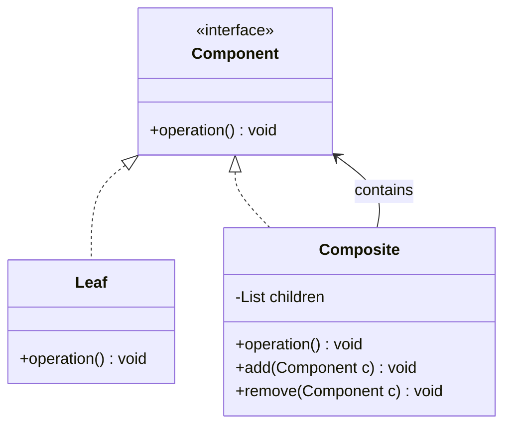
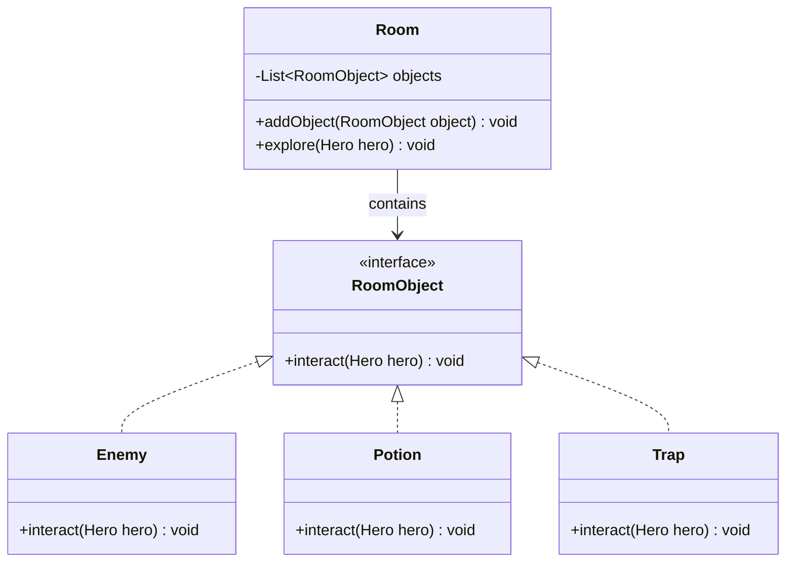

## **Composite Pattern**

Composite Pattern digunakan untuk menyusun objek dalam struktur pohon sehingga klien dapat memperlakukan objek individual dan komposisi objek secara seragam. Pola ini berguna ketika sebuah elemen memiliki bagian-bagian yang dapat berisi elemen lain dengan hierarki yang sama.

### **Struktur Kelas Composite Pattern**

Composite Pattern digunakan untuk mengelola objek dalam ruangan. `RoomObject` bertindak sebagai komponen dasar, sementara `Enemy`, `Potion`, dan `Trap` adalah objek konkret yang dapat berinteraksi dengan pemain. `Room` berfungsi sebagai komposit yang dapat menyimpan banyak `RoomObject`.

Dalam implementasinya, `Room` menyimpan daftar `RoomObject`, yang bisa berupa musuh, potion, atau jebakan. Saat `explore()` dipanggil, ruangan akan berinteraksi dengan semua objek yang ada di dalamnya. Dengan pendekatan ini, menambahkan objek baru ke ruangan tidak memerlukan perubahan besar dalam kode.