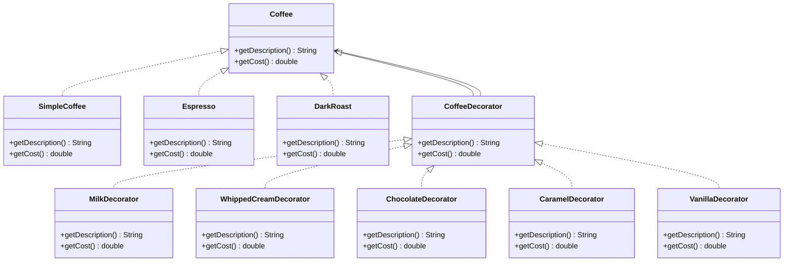

## **Composite Pattern**

Composite Pattern digunakan untuk menyusun objek dalam struktur pohon sehingga klien dapat memperlakukan objek
individual dan komposisi objek secara seragam. Pola ini berguna ketika sebuah elemen memiliki bagian-bagian yang dapat
berisi elemen lain dengan hierarki yang sama.

### **Struktur Kelas Composite Pattern**

Composite Pattern digunakan untuk mengelola objek dalam ruangan. `RoomObject` bertindak sebagai komponen dasar,
sementara `Enemy`, `Potion`, dan `Trap` adalah objek konkret yang dapat berinteraksi dengan pemain. `Room` berfungsi
sebagai komposit yang dapat menyimpan banyak `RoomObject`.

Dalam implementasinya, `Room` menyimpan daftar `RoomObject`, yang bisa berupa musuh, potion, atau jebakan. Saat
`explore()` dipanggil, ruangan akan berinteraksi dengan semua objek yang ada di dalamnya. Dengan pendekatan ini,
menambahkan objek baru ke ruangan tidak memerlukan perubahan besar dalam kode.

---

## **Adapter Pattern**

Adapter Pattern adalah pola desain yang digunakan untuk membuat dua antarmuka yang tidak kompatibel bisa bekerja
bersama. Dalam beberapa kasus, ada sebuah kelas yang memiliki cara kerja berbeda dengan antarmuka yang digunakan dalam
sistem. Jika ingin menggunakan kelas tersebut tanpa mengubah strukturnya, adapter dapat digunakan sebagai perantara.
Adapter bertugas menerjemahkan perintah dari satu bentuk ke bentuk lain agar sesuai dengan antarmuka yang diharapkan.

### **Struktur Kelas Adapter Pattern**

Dalam implementasi ini, Adapter Pattern digunakan untuk menghubungkan kontroler klasik dengan sistem permainan yang
hanya mendukung kontroler modern. Kontroler klasik memiliki cara kerja yang tidak sepenuhnya kompatibel dengan sistem
permainan karena menggunakan angka untuk tombol dan hanya memiliki D-pad untuk navigasi. Sedangkan sistem permainan
mengharapkan kontroler dengan tombol bernama, joystick, dan pemicu aksi berbasis tekanan.

Untuk menyelaraskan perbedaan ini, dibuatlah `ClassicControllerAdapter`. Adapter ini menerjemahkan tombol bernama
menjadi angka yang sesuai dengan kontroler klasik. Pergerakan joystick dikonversi menjadi navigasi D-pad dengan
menentukan apakah gerakan lebih dominan ke arah horizontal atau vertikal. Pemicu aksi juga disesuaikan dengan menekan
tombol tertentu jika tekanan yang diberikan memenuhi ambang batas tertentu.

Selain kontroler klasik, sistem juga mendukung kontroler modern seperti `PS5Controller`, yang sudah sesuai dengan
antarmuka yang diharapkan tanpa memerlukan adapter. Dengan adanya adapter, berbagai jenis kontroler bisa digunakan tanpa
perlu mengubah struktur permainan. Jika ada kontroler lain yang tidak kompatibel, cukup dibuat adapter yang sesuai agar
dapat digunakan dalam sistem.

---

## **Bridge Pattern**

Bridge Pattern adalah pola desain yang memisahkan abstraksi dari implementasinya sehingga keduanya dapat bervariasi
secara independen. Pola ini berguna untuk mengurangi kompleksitas kode dengan memisahkan antarmuka dari
fungsionalitasnya.

### **Struktur Kelas Bridge Pattern**

Dalam implementasi ini, Bridge Pattern digunakan untuk memisahkan antarmuka remote control dari perangkat yang
dikendalikannya. `RemoteControl` adalah abstraksi dasar, sementara `BasicRemote` dan `AdvancedRemote` adalah abstraksi
yang lebih spesifik. `Device` adalah implementor yang diwakili oleh `TV` dan `Radio`.

Dalam implementasinya, `RemoteControl` menyimpan referensi ke `Device`, yang bisa berupa `TV` atau `Radio`.
`BasicRemote` menyediakan kontrol dasar seperti menghidupkan/mematikan perangkat, mengatur volume, dan mengganti
saluran. `AdvancedRemote` menambahkan fitur tambahan seperti mute dan pengaturan saluran favorit. Dengan pendekatan ini,
menambahkan perangkat baru atau remote control baru tidak memerlukan perubahan besar dalam kode.

---

## **Decorator Pattern**

Decorator Pattern adalah pola desain yang memungkinkan penambahan perilaku baru pada objek secara dinamis dengan
membungkusnya dalam objek dekorator. Pola ini berguna untuk memperluas fungsionalitas objek tanpa mengubah kodenya.

### **Struktur Kelas Decorator Pattern**

Dalam implementasi ini, Decorator Pattern digunakan untuk menambahkan fitur tambahan pada objek kopi. `Coffee` adalah
komponen dasar, sementara `SimpleCoffee`, `Espresso`, dan `DarkRoast` adalah komponen konkret. `CoffeeDecorator` adalah
dekorator abstrak yang diimplementasikan oleh dekorator konkret seperti `MilkDecorator`, `WhippedCreamDecorator`,
`ChocolateDecorator`, `CaramelDecorator`, dan `VanillaDecorator`.

Dalam implementasinya, `CoffeeDecorator` membungkus objek `Coffee` dan menambahkan fitur tambahan seperti susu, krim
kocok, cokelat, karamel, dan vanila. Dengan pendekatan ini, kita dapat membuat berbagai kombinasi kopi dengan fitur
tambahan tanpa mengubah struktur dasar objek kopi.

---

## **Proxy Pattern**

Proxy Pattern adalah pola desain yang menyediakan pengganti atau placeholder untuk objek lain untuk mengontrol akses ke
objek tersebut. Pola ini berguna untuk mengimplementasikan lazy initialization, kontrol akses, logging, dan lainnya.

### **Struktur Kelas Proxy Pattern**

Dalam implementasi ini, Proxy Pattern digunakan untuk mengontrol akses ke internet. `Internet` adalah antarmuka subjek,
`RealInternet` adalah subjek nyata, dan `ProxyInternet` adalah proxy yang mengontrol akses ke subjek nyata.

Dalam implementasinya, `ProxyInternet` mengontrol akses ke `RealInternet` dengan memeriksa apakah situs yang diminta
dibatasi dan mencatat akses. `OfficeNetworkProxy` memperluas `ProxyInternet` untuk menambahkan pemeriksaan tambahan
untuk produktivitas selama jam kerja. Pendekatan ini memungkinkan akses yang fleksibel dan terkontrol ke internet tanpa
mengubah subjek nyata.

---

## **Flyweight Pattern**

Flyweight Pattern adalah pola desain yang meminimalkan penggunaan memori dengan berbagi data sebanyak mungkin dengan
objek serupa. Pola ini berguna untuk mengurangi jumlah objek yang dibuat dan mengurangi jejak memori.

### **Struktur Kelas Flyweight Pattern**

Dalam implementasi ini, Flyweight Pattern digunakan untuk mengelola entitas permainan seperti pohon di hutan.
`GameEntity` adalah antarmuka flyweight, `Tree` adalah flyweight konkret, dan `GameEntityFactory` adalah pabrik
flyweight.

Dalam implementasinya, `GameEntityFactory` mengelola pembuatan dan penggunaan kembali objek `Tree`. `ForestRenderer`
menggunakan objek flyweight ini untuk merender hutan dengan banyak pohon, berbagi status intrinsik (seperti tekstur dan
poligon) di antara pohon-pohon dengan jenis yang sama. Pendekatan ini mengurangi penggunaan memori dengan menggunakan
kembali objek pohon.